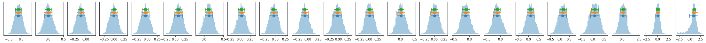

```python
import os
import sys
base_dir = '/home/abzoghbi/data/mcg5-23-16/nustar_re_analysis'
if not base_dir in sys.path: sys.path.insert(0, base_dir)

from helpers import *

%load_ext autoreload
%autoreload 2
```


```python
os.chdir(base_dir)
wdir = 'data/timing'
os.system('mkdir -p %s/lag'%wdir)
os.chdir(wdir)

nu_obsids = np.array(['60001046002', '60001046004', '60001046006', '60001046008'])
```


```python
#!rm lc_22l3_512.npz
loc_info, nen, dt = [base_dir, '22l3'], 22, 512
LC = read_lc(loc_info, nu_obsids, dt, nen, combine_ab=True)

#!rm lc_22l3_512_bgd.npz
loc_info, nen, dt = [base_dir, '22l3'], 22, 512
LCb = read_lc(loc_info, nu_obsids, dt, nen, combine_ab=True, bgd=True)

LC = remove_high_bgd(LC, LCb)
```

    reading data from lc_22l3_512.npz ..
    reading data from lc_22l3_512_bgd.npz ..


```python
# average counts per bin #
txt = '\n'.join([' '.join(['%8.4g'%(l[1].mean()*dt) for l in lc]) for lc in LC])
print(txt)
```

       133.7    89.82    101.6    104.7
         176    116.9    133.9    136.4
       244.6      162    187.2    191.9
       252.8    170.1    194.2    199.9
       224.6    151.5    172.4    176.7
       269.9    183.8    207.5    214.8
       281.8    193.2    218.4    225.7
       347.1    241.9    269.1    278.8
       318.7    225.6    247.7    257.9
       300.4    212.5    236.5    245.7
         244    171.7    191.7    200.5
         252    179.5    199.1    208.1
       250.6    176.8    198.5      208
       325.2    234.2    258.1    272.4
       260.2    188.3    207.4    217.4
       203.2    146.9    160.4      170
       155.1    113.7    123.8    131.4
       111.9    81.72    89.02    94.24
       152.5    111.6    119.7    126.4
       58.02    45.44    47.16    52.52
       32.03    26.58    28.11    30.25
        15.4    16.59    13.63    17.31


```python
# plot light curves
ie = 21
nlc = len(LC[ie])
fig, ax = plt.subplots(nlc, 1, figsize=(12, 8))
for ilc,lc in enumerate(LC[ie]):
    ax[ilc].errorbar((lc[0] - lc[0][0])/1e3, lc[1], lc[2], fmt='o', ms=3, alpha=0.5)
    ax[ilc].set_xlim([0, 450])
    
```


    

    


### Prepare Segments 


```python
ebins, dt = ('3 3.3 3.6 4 4.4 4.8 5.2 5.7 6.3 6.9 7.6 8.3 9.1 10 '
             '11.7 13.8 16.2 19 22 31 42 58 79'), 512

tlen = 200
Lc, LcIdx = split_LC_to_segments(LC, tlen*1e3, plot=False)
```

### `_f7`: Fig. 7 in Zoghbi+14: `6e-6 6e-4`
Note that because of the segment lengths, the effective low bin bounday is 1e-5, so we use it


```python
fqL = np.array([2e-6, 6e-6, 6e-4, 1.3e-3])
iEn = None
lag_f7 = calculate_lag(Lc, fqL, dt, ebins, 'lag/lag_22l3_f7.npz', iEn=iEn,  mcmc=[-4, 2000], logmod=False)
```

    cache file lag/lag_22l3_f7.npz found. Reading ...!


```python
lag_f7a = calculate_lag(Lc, fqL, dt, ebins, 'lag/lag_22l3_f7a.npz', iEn=iEn, iLc=[0],  
                        mcmc=[-4, 2000], logmod=False)
```

    cache file lag/lag_22l3_f7a.npz found. Reading ...!


```python
#lag_f7b = calculate_lag(Lc, fqL, dt, ebins, 'lag/lag_22l3_f7b.npz', iEn=iEn, iLc=[1],
#                        mcmc=[-4, 2000], logmod=False)
```


```python
#lag_f7c = calculate_lag(Lc, fqL, dt, ebins, 'lag/lag_22l3_f7c.npz', iEn=iEn, iLc=[2],
#                        mcmc=[-4, 2000], logmod=False)
```


```python
lag_f7d = calculate_lag(Lc, fqL, dt, ebins, 'lag/lag_22l3_f7d.npz', iEn=iEn, iLc=[3], 
                        mcmc=[-4, 2000], logmod=False)
```

    cache file lag/lag_22l3_f7d.npz found. Reading ...!


```python
lag_f7bc = calculate_lag(Lc, fqL, dt, ebins, 'lag/lag_22l3_f7bc.npz', iEn=iEn, iLc=[1,2], 
                          mcmc=[-4, 2000], logmod=False)
```

    cache file lag/lag_22l3_f7bc.npz found. Reading ...!


```python
# process mcmc from fqlag and plot histograms 
lagMC_f7   = proc_lag_mcmc('lag_22l3_f7')
lagMC_f7a  = proc_lag_mcmc('lag_22l3_f7a')
lagMC_f7d  = proc_lag_mcmc('lag_22l3_f7d')
lagMC_f7bc = proc_lag_mcmc('lag_22l3_f7bc')

```


    

    


    

    


    

    


    

    


```python
for x in ['a', 'd', '', 'bc']:
    exec('plot_lag(lagMC_f7%s)'%x)
    exec('write_lag(lagMC_f7%s, "_22l3MC_f7%s", pha=True)'%(x,x))
```


    

    


    

    


    

    


    

    


```python
### Model the PHA data with xspec
os.chdir('%s/%s/lag/pha'%(base_dir, wdir))
for x in ['a', 'bc', 'd', '']:
    fit_pha_with_loglin('22l3MC_f7%s__1'%x, recalc=1)
os.chdir('%s/%s'%(base_dir, wdir))
```

    chains for 22l3MC_f7a__1
    chains for 22l3MC_f7bc__1
    chains for 22l3MC_f7d__1
    chains for 22l3MC_f7__1


    

    


    

    


    

    


    

    


---
### Followup the `_fqMC__1` results (in lag_22l3b)


```python
# 2.31413e-06 4.97082e-06 2.13549e-05 4.5871e-05 9.85324e-05 0.000211651 0.000454632 0.00195312
fqL = np.array([2e-6, 5e-6, 2e-5, 1e-4, 2e-4, 2e-3])
iEn = None
lag_e1 = calculate_lag(Lc, fqL, dt, ebins, 'lag/lag_22l3_e1.npz', iEn=iEn, mcmc=[-4, 2000], logmod=False)
```

    cache file lag/lag_22l3_e1.npz found. Reading ...!


```python
# process mcmc from fqlag and plot histograms 
lagMC_e1   = proc_lag_mcmc('lag_22l3_e1')
```


    

    


```python
plot_lag(lagMC_e1)
write_lag(lagMC_e1, '_22l3MC_e1', pha=True)
```


    

    


```python
# Model the PHA data from fqlag mcmc with xspec
os.chdir('%s/%s/lag/pha'%(base_dir, wdir))
fit_pha_with_loglin('22l3MC_e1__1', recalc=1)
fit_pha_with_loglin('22l3MC_e1__2', recalc=1)
fit_pha_with_loglin('22l3MC_e1__3', recalc=1)
os.chdir('%s/%s'%(base_dir, wdir))
```

    chains for 22l3MC_e1__1
    chains for 22l3MC_e1__2
    chains for 22l3MC_e1__3


    

    


    

    


    

    


```python

```
