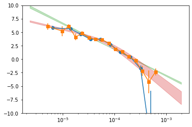

```python
import os
import sys
base_dir = '/home/abzoghbi/data/mcg5-23-16/nustar_re_analysis'
if not base_dir in sys.path: sys.path.insert(0, base_dir)

from helpers import *

%load_ext autoreload
%autoreload 2
```

    The autoreload extension is already loaded. To reload it, use:
      %reload_ext autoreload


```python
os.chdir(base_dir)
wdir = 'data/timing'
os.system('mkdir -p %s'%wdir)
os.chdir(wdir)

nu_obsids = np.array(['60001046002', '60001046004', '60001046006', '60001046008'])
```

## 3-79 keV Total light curve


```python
#!rm lc_1b_512.npz
loc_info, nen, dt = [base_dir, '1b'], 1, 512
LC = read_lc(loc_info, nu_obsids, dt, nen, combine_ab=True)

#!rm lc_22l3_512_bgd.npz
loc_info, nen, dt = [base_dir, '22l3'], 22, 512
LCb = read_lc(loc_info, nu_obsids, dt, nen, combine_ab=True, bgd=True)

LC = remove_high_bgd(LC, LCb)
```

    reading data from lc_1b_512.npz ..
    reading data from lc_22l3_512_bgd.npz ..


```python
# plot light curves
nlc = len(LC[0])
fig, ax = plt.subplots(nlc, 1, figsize=(12, 8))
for ilc,lc in enumerate(LC[0]):
    ax[ilc].errorbar((lc[0] - lc[0][0])/1e3, lc[1], lc[2], fmt='o', ms=3, alpha=0.5)
    ax[ilc].set_xlim([0, 450])
    
```


    

    


```python
dates = []
for o in nu_obsids:
    with pyfits.open(f'{base_dir}/data/nustar/{o}_p/lc/1b/lc_512__a__1.lc') as fp:
        dates.append(fp[1].header['date-obs'])
dates = TT.Time(dates)
```


```python
# write lc
os.system('mkdir -p psd')
txt = ''
t0 = 0
for ilc,lc in enumerate(LC[0]):
    tt = lc[0] - lc[0][0] + t0
    t0 = tt[-1] + 1e4
    tmjd = (dates[ilc] + TT.TimeDelta(lc[0] - lc[0][0], format='sec')).mjd
    txt += '\ndescriptor t_%d rate_%d,+- tt_%d tmjd_%d\n'%(ilc+1,ilc+1,ilc+1, ilc+1)
    txt += '\n'.join(['%10.10g %10.3g %10.3g %10.10g %10.7g'%(t,r,re,t_,_tm) for t,r,re,t_,_tm in 
                      zip(lc[0]-lc[0][0], lc[1], lc[2], tt, tmjd)])
with open('psd/lc_%g.plot'%(dt), 'w') as fp: fp.write(txt)
```

---
## PSD


```python
# get segments #
tlen = 200
Lc, LcIdx = split_LC_to_segments(LC, tlen*1e3, plot=False)
```


```python
# frequency bins
fqL, fqd = get_fq_bins(Lc[0], dt, mode=1, Nfq=10, nyquist=0.5)
psd_all_f1 = calculate_psd(Lc[0], fqL, 'psd/psd_all_f1.npz', errors=True)
```

    nfq:  12
    fqL:  2.31413e-06 3.61475e-06 1.12927e-05 1.76396e-05 2.75536e-05 4.30396e-05 6.72293e-05 0.000105014 0.000164036 0.00025623 0.000400239 0.000625187 0.00195312


```python
# Another frequency binning
fqL, fqd = get_fq_bins(Lc[0], dt, mode=1, Nfq=16, nyquist=0.5)
psd_all_f2 = calculate_psd(Lc[0], fqL, 'psd/psd_all_f2.npz', errors=True)
```

    nfq:  18
    fqL:  2.31413e-06 3.1154e-06 8.38825e-06 1.12927e-05 1.52028e-05 2.04669e-05 2.75536e-05 3.70941e-05 4.99381e-05 6.72293e-05 9.05077e-05 0.000121846 0.000164036 0.000220834 0.000297299 0.000400239 0.000538823 0.000725393 0.00195312
      -241.253 |       6.72       6.09       5.22       6.09        4.1        4.8       3.95       3.68       3.62       2.94       1.87       1.38      0.469     -0.256      -2.19      -4.19      -2.33      -4.39 |   1.32e-06
    ** done **
    
      -241.253 |       6.72       6.09       5.22       6.09        4.1        4.8       3.95       3.68       3.62       2.94       1.87       1.38      0.469     -0.256      -2.19      -4.19      -2.33      -4.39 |   1.42e-06
    ** done **
    
    	## errors for param 0 ##
       -241.253   -241.749    6.71822    7.53072   0.991894
    	## errors for param 1 ##
       -241.253   -241.748    6.08609    6.68765   0.990162
    	## errors for param 2 ##
       -241.253   -241.756      5.217    6.13888    1.00621
    	## errors for param 3 ##
       -241.253   -241.749    6.08799    6.48643   0.991016
    	## errors for param 4 ##
       -241.253   -241.753    4.09752    4.71081    0.99932
    	## errors for param 5 ##
       -241.253   -241.749    4.80145    5.16082   0.991867
    	## errors for param 6 ##
       -241.253   -241.755    3.94619    4.25869    1.00452
    	## errors for param 7 ##
       -241.253   -241.749    3.67748    3.95091   0.991426
    	## errors for param 8 ##
       -241.253   -241.749    3.61894    3.85722   0.992202
    	## errors for param 9 ##
       -241.253    -241.75    2.94037    3.14545   0.993896
    	## errors for param 10 ##
       -241.253   -241.751    1.86759    2.07657   0.995739
    	## errors for param 11 ##
       -241.253   -241.758     1.3759    1.57316    1.00974
    	## errors for param 12 ##
       -241.253   -241.756    0.46884    0.71884    1.00605
    	## errors for param 13 ##
       -241.253    -241.75  -0.256087  0.0720384     0.99286
    	## errors for param 14 ##
       -241.253   -241.752   -2.19453   -1.27265   0.997586
    	## errors for param 15 ##
       -241.253   -241.751   -4.19081   -2.09121   0.994696
    	## errors for param 16 ##
       -241.253   -241.752   -2.32877   -1.69205   0.997702
    	## errors for param 17 ##
       -241.253   -241.751   -4.39141    -3.3543   0.995653
    ********************
          6.72       6.09       5.22       6.09        4.1        4.8       3.95       3.68       3.62       2.94       1.87       1.38      0.469     -0.256      -2.19      -4.19      -2.33      -4.39
         0.812      0.602      0.922      0.398      0.613      0.359      0.312      0.273      0.238      0.205      0.209      0.197       0.25      0.328      0.922        2.1      0.637       1.04
    ********************


```python
# Analytical fit with PL and BPL
psd_all_f = calculate_psd(Lc[0], fqL, 'psd/psd_all_f.npz', do_bin=0, do_pl=1, do_bpl=1, errors=True)
```

      -285.513 |      -17.5       -2.1 |   7.72e-09
    ** done **
    
      -285.513 |      -17.5       -2.1 |   9.71e-06
    ** done **
    
    	## errors for param 0 ##
       -285.513   -286.012   -17.5315   -17.0033   0.997351
    	## errors for param 1 ##
       -285.513   -286.015   -2.09807   -2.04009    1.00242
    ********************
         -17.5       -2.1
         0.528      0.058
    ********************
      -247.275 |      -5.94       -3.3      -9.47 |   1.42e-07
    ** done **
    
      -247.275 |      -5.94       -3.3      -9.47 |   4.45e-07
    ** done **
    
    	## errors for param 0 ##
       -247.275   -247.773   -5.94215   -5.79176   0.995061
    	## errors for param 1 ##
       -247.275   -247.779   -3.29512   -3.05293    1.00798
    	## errors for param 2 ##
       -247.275   -247.776   -9.46832   -9.32086    1.00245
    ********************
         -5.94       -3.3      -9.47
          0.15      0.242      0.147
    ********************


```python
# plot the psd #

pBin = psd_all_f1['p_Bin']
plt.errorbar(pBin[0][1:-1], pBin[1][1:-1], pBin[2][1:-1], fmt='o-')

pBin = psd_all_f2['p_Bin']
plt.errorbar(pBin[0][1:-1], pBin[1][1:-1], pBin[2][1:-1], fmt='s-')

mPL = psd_all_f['m_pl']
plt.fill_between(mPL[0], mPL[1]-mPL[2], mPL[1]+mPL[2], alpha=0.3, color='C2')

mBPL = psd_all_f['m_bpl']
plt.fill_between(mBPL[0], mBPL[1]-mBPL[2], mBPL[1]+mBPL[2], alpha=0.3, color='C3')
plt.xscale('log')
plt.ylim([-10, 10])
```


    (-10, 10)


    

    


```python
# write psd_all #
txt = 'descriptor fq_f1 psd_f1,+-\n'
txt += '\n'.join(['%g %g %g'%(z[0], z[1], z[2]) for z in psd_all_f1['p_Bin'][:,1:-1].T])
txt += '\ndescriptor fq_f2 psd_f2,+-\n'
txt += '\n'.join(['%g %g %g'%(z[0], z[1], z[2]) for z in psd_all_f1['p_Bin'][:,1:-1].T])
txt += '\ndescriptor fq_pl psd_pl,+-\n'
txt += '\n'.join(['%g %g %g'%(z[0], z[1], z[2]) for z in psd_all_f['m_pl'].T])
txt += '\ndescriptor fq_bpl psd_bpl,+-\n'
txt += '\n'.join(['%g %g %g'%(z[0], z[1], z[2]) for z in psd_all_f['m_bpl'].T])
with open('psd/psd_all.plot', 'w') as fp: fp.write(txt)
    
p,pe = psd_all_f1['p_Bin'][1:,1:-1]
fqL = psd_all_f1['fqL'][1:-1]
az.misc.write_pha_spec(fqL[:-1], fqL[1:], p, pe, 'psd_f1')
p,pe = psd_all_f2['p_Bin'][1:,1:-1]
fqL = psd_all_f2['fqL'][1:-1]
az.misc.write_pha_spec(fqL[:-1], fqL[1:], p, pe, 'psd_f2')
os.system('mkdir -p psd/pha')
os.system('mv *pha *rsp *xsp psd/pha')
```

    psd_f1.pha was created successfully
    psd_f2.pha was created successfully


    0


```python

```
