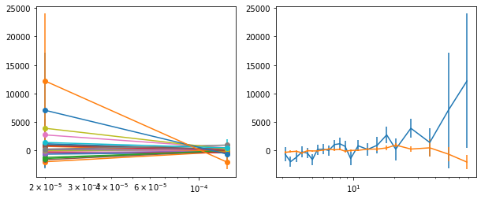
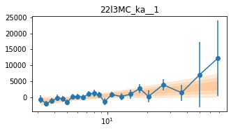

```python
import os
import sys
base_dir = '/home/abzoghbi/data/swift_j2127.4p5654/nustar_re_analysis'
if not base_dir in sys.path: sys.path.insert(0, base_dir)

from helpers import *

%load_ext autoreload
%autoreload 2
```


```python
os.chdir(base_dir)
wdir = 'data/timing'
os.system('mkdir -p %s/lag'%wdir)
os.chdir(wdir)

nu_obsids = np.array(['60001110002', '60001110003', '60001110005', '60001110007', '60402008002', 
                      '60402008004', '60402008006', '60402008008', '60402008010'])
```


```python
#!rm lc_22l3_512.npz
loc_info, nen, dt = [base_dir, '22l3'], 22, 512
LC = read_lc(loc_info, nu_obsids, dt, nen, combine_ab=True)

#!rm lc_22l3_512_bgd.npz
loc_info, nen, dt = [base_dir, '22l3'], 22, 512
LCb = read_lc(loc_info, nu_obsids, dt, nen, combine_ab=True, bgd=True)

LC = remove_high_bgd(LC, LCb)
```

    reading data from lc_22l3_512.npz ..
    reading data from lc_22l3_512_bgd.npz ..


```python
# average counts per bin #
txt = '\n'.join([' '.join(['%8.4g'%(l[1].mean()*dt) for l in lc]) for lc in LC])
print(txt)
```

        33.5    40.17     41.4    48.36    91.71    64.85    58.67     36.4    44.19
       41.37    49.85    54.18    63.63    116.6    79.83    73.23    47.57    56.68
       54.66    66.92     72.2    83.11    156.6    107.1    101.9    62.04    77.98
       57.78    72.51    74.98     87.9    155.1    107.1    102.1    64.67    78.53
       49.26    58.26    64.74    73.18    132.9    94.03    86.33    55.96    68.06
       58.08    71.51    76.28    89.05    156.4    107.1    102.2    66.98    81.55
        61.2    72.68    80.47    89.09    156.8    111.3      105    71.16    84.51
       74.74    86.35    97.36    105.2    182.7    131.2    123.6    84.09    101.3
       69.28    79.38    86.56    97.72    165.5    120.4    112.8    76.94    90.29
       63.14    76.12    81.98    91.67    152.2    112.1    104.7    72.22    84.63
       51.71    60.75     66.5    75.92    121.8     86.5    84.35    57.03    69.46
       53.33    63.99    68.82       75    121.1    86.63    84.22    59.21    70.71
       53.35    60.36    66.65    74.99    115.3    83.44    81.05    58.84    68.36
       69.63    79.44    85.82    95.91    143.6    105.4      104    76.96    87.22
        52.8    65.81    70.08    75.11    111.5    79.41    80.38    61.22    69.92
       44.34    51.31    56.89    61.18    85.74    62.54    62.75       49    58.29
       34.55     42.1    44.58    46.11    63.67    48.62    47.44    38.31    43.68
       25.54    29.19    32.42     32.8    41.72    33.67    35.28    27.73    31.83
       35.22    39.32     42.8    44.01    50.85    42.72    43.74    36.99    40.73
       15.51    15.12    15.75    14.79       17    14.21    15.88    14.58    14.58
       11.93    11.19    10.11     8.89    11.21     9.62    10.91    9.911     8.34
       15.18    9.826     9.52    7.557    9.457    10.23    12.89    10.81    8.771


```python
# plot light curves
ie = 21
nlc = len(LC[ie])
fig, ax = plt.subplots(nlc, 1, figsize=(12, 10))
for ilc,lc in enumerate(LC[ie]):
    ax[ilc].errorbar((lc[0] - lc[0][0])/1e3, lc[1], lc[2], fmt='o', ms=3, alpha=0.5)
    ax[ilc].set_xlim([0, 150])
plt.tight_layout()
```


    

    


```python
ebins, dt = ('3 3.3 3.6 4 4.4 4.8 5.2 5.7 6.3 6.9 7.6 8.3 9.1 10 '
             '11.7 13.8 16.2 19 22 31 42 58 79'), 512
tlen = 70
Lc, LcIdx = split_LC_to_segments(LC, tlen*1e3, plot=False)
```

### `_k`: Reproduce lags in Fig 3 and 4 in Kara+14: `<4e-5 4.5e-4`


```python
fqL = np.array([8e-6, 1e-5, 4e-5, 4.5e-4, 2e-3])
iEn = None
lag_k = calculate_lag(Lc, fqL, dt, ebins, 'lag/lag_22l3_k.npz', iEn=iEn, mcmc=[-4, 2000], logmod=False)
```

    cache file lag/lag_22l3_k.npz found. Reading ...!


```python
lag_ka = calculate_lag(Lc, fqL, dt, ebins, 'lag/lag_22l3_ka.npz', iEn=iEn, iLc=[0,1,2,3],  
                       mcmc=[-4, 2000], logmod=False)
```

    cache file lag/lag_22l3_ka.npz found. Reading ...!


```python
lag_kb = calculate_lag(Lc, fqL, dt, ebins, 'lag/lag_22l3_kb.npz', iEn=iEn, iLc=[4,5,6,7,8], 
                      mcmc=[-4, 2000], logmod=False)
```

    cache file lag/lag_22l3_kb.npz found. Reading ...!


```python
lagMC_k = proc_lag_mcmc('lag_22l3_k')
lagMC_ka = proc_lag_mcmc('lag_22l3_ka')
lagMC_kb = proc_lag_mcmc('lag_22l3_kb')
```


    

    


    

    


    

    


```python
for x in ['a', 'b', '']:
    exec('plot_lag(lagMC_k%s)'%x)
    exec('write_lag(lagMC_k%s, "_22l3MC_k%s", pha=True)'%(x,x))
```


    

    


    

    


    

    


```python
# Model the PHA data with `xspec`
os.chdir('%s/%s/lag/pha'%(base_dir, wdir))
for x in ['a', 'b', '']:
    fit_pha_with_loglin('22l3MC_k%s__1'%x, recalc=1)
    fit_pha_with_loglin('22l3MC_k%s__2'%x, recalc=1)
os.chdir('%s/%s'%(base_dir, wdir))
```

    chains for 22l3MC_ka__1
    chains for 22l3MC_ka__2
    chains for 22l3MC_kb__1
    chains for 22l3MC_kb__2
    chains for 22l3MC_k__1
    chains for 22l3MC_k__2


    

    


    

    


    

    


    

    


    

    


    

    


---
### `_e1`: Followup the `_fqMC__1` results (from lag_22l3b)


```python
# 5.71089e-06 1.0782e-05 4.07122e-05 7.68634e-05 0.000145116 0.000273974 0.000517255 0.00195312
fqL = np.array([5e-6, 1e-5, 8e-5, 1.5e-4, 3e-4, 2e-3])
iEn = None
lag_e1 = calculate_lag(Lc, fqL, dt, ebins, 'lag/lag_22l3_e1.npz', iEn=iEn, mcmc=[-4, 2000], logmod=False)
```

    cache file lag/lag_22l3_e1.npz found. Reading ...!


```python
# process mcmc from fqlag and plot histograms 
lagMC_e1   = proc_lag_mcmc('lag_22l3_e1')
```


    

    


```python
plot_lag(lagMC_e1)
write_lag(lagMC_e1, '_22l3MC_e1', pha=True)
```


    

    


```python
# Model the PHA data from fqlag mcmc with xspec
os.chdir('%s/%s/lag/pha'%(base_dir, wdir))
fit_pha_with_loglin('22l3MC_e1__1', recalc=1)
fit_pha_with_loglin('22l3MC_e1__2', recalc=1)
fit_pha_with_loglin('22l3MC_e1__3', recalc=1)
os.chdir('%s/%s'%(base_dir, wdir))
```

    chains for 22l3MC_e1__1
    chains for 22l3MC_e1__2
    chains for 22l3MC_e1__3


    

    


    

    


    

    


---
### `_e1C`: Similar `_e1` but fit for the full cross spectrum instead of a transfer function


```python
fqL = np.array([5e-6, 1e-5, 8e-5, 1.5e-4, 3e-4, 2e-3])
iEn = None
lag_e1C = calculate_lag_cross(Lc, fqL, dt, ebins, 'lag/lag_22l3_e1C.npz', iEn=iEn, mcmc=[-4, 2000], logmod=False)
```

    using irand: 77276448
    
    
    ----- en: 1 of 22 -----
    
       184.432 |       6.61       4.79       3.21       2.77      -1.11 |   6.34e-05
    ** done **
    
       184.432 |       6.61       4.79       3.21       2.77      -1.11 |   1.49e-05
    ** done **
    
       184.432 |       6.61       4.79       3.21       2.77      -1.11 |   4.64e-05
    ** done **
    
       184.432 |       6.61       4.79       3.21       2.77      -1.11 |   9.39e-06
    ** done **
    
       184.432 |        740        120       24.7         16      0.331 |   2.09e-05
    ** done **
    
       2848.15 |       7.63       4.94          2       2.28      0.923 |   2.75e-05
    ** done **
    
       2848.15 |       7.63       4.94          2       2.28      0.923 |   8.08e-07
    ** done **
    
       2848.15 |       7.63       4.94          2       2.28      0.923 |   1.21e-05
    ** done **
    
       2848.15 |       7.63       4.94          2       2.28      0.923 |   1.58e-05
    ** done **
    
       2848.15 |   2.06e+03        140       7.36       9.74       2.52 |   3.21e-07
    ** done **
    
        3179.9 |   1.22e+03        121       34.1       25.2       22.5     0.0763    -0.0963      0.866       1.01       1.56 |    9.6e-05
    ** done **
    
        3179.9 |   1.22e+03        121       34.1       25.2       22.5     0.0763    -0.0963      0.866       1.01       1.56 |   2.17e-05
    ** done **
    
          -100 |   1.21e+03        121       31.3       50.2       21.4     0.0268     -0.132       1.02       1.16       1.57 |      1e+05
    ** done **
    
    ** mcmc chain **
    acceptance fraction:  0.31748750000000003


    /home/abzoghbi/soft/anaconda3/lib/python3.8/site-packages/numpy/core/_asarray.py:136: VisibleDeprecationWarning: Creating an ndarray from ragged nested sequences (which is a list-or-tuple of lists-or-tuples-or ndarrays with different lengths or shapes) is deprecated. If you meant to do this, you must specify 'dtype=object' when creating the ndarray
      return array(a, dtype, copy=False, order=order, subok=True)


    saved temporary data to tmp_77276448__1.npz
    
    ----- en: 2 of 22 -----
    
       194.287 |       6.59       4.77       3.19       2.76      -1.09 |   2.04e-05
    ** done **
    
       194.287 |       6.59       4.77       3.19       2.76      -1.09 |   6.25e-06
    ** done **
    
       194.287 |       6.59       4.77       3.19       2.76      -1.09 |   6.92e-05
    ** done **
    
       194.287 |       6.59       4.77       3.19       2.76      -1.09 |   6.98e-06
    ** done **
    
       194.287 |        727        118       24.4       15.8      0.335 |   1.71e-05
    ** done **
    
          2662 |       7.56       5.13       3.07       3.07      -0.26 |   1.26e-06
    ** done **
    
          2662 |       7.56       5.13       3.07       3.07      -0.26 |    2.9e-05
    ** done **
    
          2662 |       7.56       5.13       3.07       3.07      -0.26 |   9.99e-06
    ** done **
    
          2662 |       7.56       5.13       3.07       3.07      -0.26 |   1.63e-05
    ** done **
    
          2662 |   1.92e+03        168       21.6       21.5      0.771 |   1.64e-06
    ** done **
    
       3063.04 |   1.17e+03        140       29.4       20.4       7.29      0.124     -0.143     -0.475     -0.616      -1.54 |    4.6e-05
    ** done **
    
       3057.97 |    1.2e+03        136       29.4       16.5      -4.46      0.133     -0.123     -0.258     -0.265      -1.54 |       2.09
    ** done **
    
          -100 |   1.16e+03        146       24.7       26.7      -8.69      0.131     -0.174      -0.55     -0.312      -1.52 |      1e+05
    ** done **
    
    ** mcmc chain **
    acceptance fraction:  0.31656249999999997


    /home/abzoghbi/soft/anaconda3/lib/python3.8/site-packages/numpy/core/_asarray.py:136: VisibleDeprecationWarning: Creating an ndarray from ragged nested sequences (which is a list-or-tuple of lists-or-tuples-or ndarrays with different lengths or shapes) is deprecated. If you meant to do this, you must specify 'dtype=object' when creating the ndarray
      return array(a, dtype, copy=False, order=order, subok=True)


    saved temporary data to tmp_77276448__2.npz
    
    ----- en: 3 of 22 -----
    
       212.743 |       6.62       4.78       3.15       2.75      -1.09 |   4.16e-05
    ** done **
    
       212.743 |       6.62       4.78       3.15       2.75      -1.09 |   1.95e-05
    ** done **
    
       212.743 |       6.62       4.78       3.15       2.75      -1.09 |   1.41e-05
    ** done **
    
       212.743 |       6.62       4.78       3.15       2.75      -1.09 |   9.56e-05
    ** done **
    
       212.743 |        751        119       23.3       15.6      0.336 |    4.2e-05
    ** done **
    
       2429.26 |        7.2       4.97       3.54       3.12      -0.52 |   5.98e-05
    ** done **
    
       2429.26 |        7.2       4.97       3.54       3.12      -0.52 |   1.73e-06
    ** done **
    
       2429.26 |        7.2       4.97       3.54       3.12      -0.52 |    4.8e-05
    ** done **
    
       2429.26 |        7.2       4.97       3.54       3.12      -0.52 |   7.24e-06
    ** done **
    
       2429.26 |   1.35e+03        144       34.5       22.8      0.595 |   2.25e-06
    ** done **
    
       2876.77 |      1e+03        130       30.6       18.5     -0.361     0.0256     -0.091      0.086     0.0611      -2.12 |       6.49
    ** done **
    
       2878.03 |      1e+03        131       29.9       18.5       4.51     0.0247     -0.101    -0.0279     -0.192      -1.53 |   4.53e-05
    ** done **
    
          -100 |   1.01e+03        128       28.2       20.5       25.3     0.0124    -0.0914      0.215       1.07      -1.42 |      1e+05
    ** done **
    
    ** mcmc chain **
    acceptance fraction:  0.29405000000000003


    /home/abzoghbi/soft/anaconda3/lib/python3.8/site-packages/numpy/core/_asarray.py:136: VisibleDeprecationWarning: Creating an ndarray from ragged nested sequences (which is a list-or-tuple of lists-or-tuples-or ndarrays with different lengths or shapes) is deprecated. If you meant to do this, you must specify 'dtype=object' when creating the ndarray
      return array(a, dtype, copy=False, order=order, subok=True)


    saved temporary data to tmp_77276448__3.npz
    
    ----- en: 4 of 22 -----
    
       218.083 |       6.61       4.78       3.18       2.76      -1.18 |   2.77e-05
    ** done **
    
       218.083 |       6.61       4.78       3.18       2.76      -1.18 |    1.3e-05
    ** done **
    
       218.083 |       6.61       4.78       3.18       2.76      -1.18 |   2.55e-05
    ** done **
    
       218.083 |       6.61       4.78       3.18       2.76      -1.18 |   3.29e-05
    ** done **
    
       218.083 |        743        120         24       15.8      0.309 |   6.82e-06
    ** done **
    
        2435.6 |        7.1       4.94       3.59       2.97     -0.312 |   2.99e-05
    ** done **
    
        2435.6 |        7.1       4.94       3.59       2.97     -0.312 |   3.63e-05
    ** done **
    
        2435.6 |        7.1       4.94       3.59       2.97     -0.312 |   9.85e-05
    ** done **
    
        2435.6 |        7.1       4.94       3.59       2.97     -0.312 |   5.64e-06
    ** done **
    
        2435.6 |   1.21e+03        139       36.1       19.4      0.732 |   2.22e-06
    ** done **
    
       2871.16 |        951        126       29.8       19.1       13.5    0.00598    -0.0151      0.293      0.627       1.54 |   2.81e-05
    ** done **
    
       2871.16 |        951        126       29.8       19.1       13.5    0.00598    -0.0151      0.293      0.627       1.54 |    5.5e-05
    ** done **
    
       2871.16 |        951        126       29.8       19.1       13.5    0.00598    -0.0151      0.293      0.627       1.54 |   8.36e-05
    ** done **
    
    ** mcmc chain **
    acceptance fraction:  0.31725
    saved temporary data to tmp_77276448__4.npz
    
    ----- en: 5 of 22 -----
    
       199.414 |       6.61       4.78        3.2       2.73      -1.05 |      5e-05
    ** done **
    
       199.414 |       6.61       4.78        3.2       2.73      -1.05 |   3.95e-05
    ** done **
    
       199.414 |       6.61       4.78        3.2       2.73      -1.05 |   1.26e-05
    ** done **
    
       199.414 |       6.61       4.78        3.2       2.73      -1.05 |   1.52e-06
    ** done **
    
       199.414 |        745        119       24.5       15.4      0.351 |   4.33e-06
    ** done **
    
        2573.8 |       7.29        4.8        3.2       3.02       -1.8 |   1.43e-05
    ** done **
    
        2573.8 |       7.29        4.8        3.2       3.02       -1.8 |   1.39e-06
    ** done **
    
        2573.8 |       7.29        4.8        3.2       3.02       -1.8 |   1.48e-05
    ** done **
    
        2573.8 |       7.29        4.8        3.2       3.02       -1.8 |   9.11e-06
    ** done **
    
        2573.8 |   1.46e+03        121       24.4       20.5      0.165 |   2.29e-06
    ** done **
    
       2992.03 |   1.04e+03        122       28.8       21.2       10.2     0.0492     -0.105     -0.513     -0.563      -1.56 |      2e-06
    ** done **
    
       2992.03 |   1.04e+03        122       28.8       21.2       10.2     0.0492     -0.105     -0.513     -0.563      -1.56 |   5.69e-05
    ** done **
    
       2992.03 |   1.04e+03        122       28.8       21.2       10.2     0.0492     -0.105     -0.513     -0.563      -1.56 |   3.57e-05
    ** done **
    
    ** mcmc chain **
    acceptance fraction:  0.323875
    saved temporary data to tmp_77276448__5.npz
    
    ----- en: 6 of 22 -----
    
       222.888 |       6.62       4.79       3.21       2.75      -1.19 |   7.81e-05
    ** done **
    
       222.888 |       6.62       4.79       3.21       2.75      -1.19 |   4.61e-05
    ** done **
    
       222.888 |       6.62       4.79       3.21       2.75      -1.19 |   5.05e-06
    ** done **
    
       222.888 |       6.62       4.79       3.21       2.75      -1.19 |   1.13e-06
    ** done **
    
       222.888 |        752        120       24.7       15.6      0.305 |   7.64e-07
    ** done **
    
       2420.97 |       6.88       4.82       3.07       3.06    -0.0554 |    5.1e-06
    ** done **
    
       2420.97 |       6.88       4.82       3.07       3.06    -0.0554 |   5.55e-05
    ** done **
    
       2420.97 |       6.88       4.82       3.07       3.06    -0.0554 |   2.54e-05
    ** done **
    
       2420.97 |       6.88       4.82       3.07       3.06    -0.0554 |   9.18e-06
    ** done **
    
       2420.97 |        973        124       21.6       21.4      0.946 |   5.12e-07
    ** done **
    
       2884.42 |        857        121       28.2       18.6       8.55     0.0285     -0.105      0.334      0.451       1.52 |   3.43e-05
    ** done **
    
       2884.42 |        857        121       28.2       18.6       8.55     0.0285     -0.105      0.334      0.451       1.52 |   8.66e-05
    ** done **
    
          -100 |        873        123       29.4       20.5       29.7    -0.0641     -0.109      0.353     0.0233       1.56 |      1e+05
    ** done **
    
    ** mcmc chain **


    /home/abzoghbi/soft/anaconda3/lib/python3.8/site-packages/emcee/moves/red_blue.py:99: RuntimeWarning: invalid value encountered in double_scalars
      lnpdiff = f + nlp - state.log_prob[j]


    acceptance fraction:  0.33935


    /home/abzoghbi/soft/anaconda3/lib/python3.8/site-packages/numpy/core/_asarray.py:136: VisibleDeprecationWarning: Creating an ndarray from ragged nested sequences (which is a list-or-tuple of lists-or-tuples-or ndarrays with different lengths or shapes) is deprecated. If you meant to do this, you must specify 'dtype=object' when creating the ndarray
      return array(a, dtype, copy=False, order=order, subok=True)


    saved temporary data to tmp_77276448__6.npz
    
    ----- en: 7 of 22 -----
    
       216.013 |       6.63       4.78       3.18       2.77      -1.14 |   7.08e-05
    ** done **
    
       216.013 |       6.63       4.78       3.18       2.77      -1.14 |   1.49e-05
    ** done **
    
       216.013 |       6.63       4.78       3.18       2.77      -1.14 |   1.71e-06
    ** done **
    
       216.013 |       6.63       4.78       3.18       2.77      -1.14 |   2.41e-05
    ** done **
    
       216.013 |        759        119       24.1         16      0.321 |   3.57e-06
    ** done **
    
       2431.45 |       6.98       4.84       3.14       2.54     -0.145 |   3.83e-05
    ** done **
    
       2431.45 |       6.98       4.84       3.14       2.54     -0.145 |   1.03e-05
    ** done **
    
       2431.45 |       6.98       4.84       3.14       2.54     -0.145 |   8.37e-06
    ** done **
    
       2431.45 |       6.98       4.84       3.14       2.54     -0.145 |   4.24e-05
    ** done **
    
       2431.45 |   1.07e+03        126         23       12.7      0.865 |   2.74e-06
    ** done **
    
       2906.12 |        909        125       24.8       16.2       4.31      0.059    -0.0496      0.132      0.188       1.48 |   8.34e-05
    ** done **
    
       2899.99 |        905        125       24.8       16.4      -6.15      0.052    -0.0585     -0.038    -0.0992       1.59 |       3.78
    ** done **
    
          -100 |        926        127       24.1       15.3       17.8     0.0847     -0.059       0.27     -0.427        1.6 |      1e+05
    ** done **
    
    ** mcmc chain **
    acceptance fraction:  0.303725


    /home/abzoghbi/soft/anaconda3/lib/python3.8/site-packages/numpy/core/_asarray.py:136: VisibleDeprecationWarning: Creating an ndarray from ragged nested sequences (which is a list-or-tuple of lists-or-tuples-or ndarrays with different lengths or shapes) is deprecated. If you meant to do this, you must specify 'dtype=object' when creating the ndarray
      return array(a, dtype, copy=False, order=order, subok=True)


    saved temporary data to tmp_77276448__7.npz
    
    ----- en: 8 of 22 -----
    
       220.764 |       6.64       4.79       3.23       2.76      -1.09 |    2.1e-05
    ** done **
    
       220.764 |       6.64       4.79       3.23       2.76      -1.09 |   9.78e-06
    ** done **
    
       220.764 |       6.64       4.79       3.23       2.76      -1.09 |   7.54e-06
    ** done **
    
       220.764 |       6.64       4.79       3.23       2.76      -1.09 |   1.62e-06
    ** done **
    
       220.764 |        765        121       25.3       15.8      0.337 |   4.85e-07
    ** done **
    
       2337.82 |       6.66       4.76       1.94       2.73     -0.319 |   9.66e-06
    ** done **
    
       2337.82 |       6.66       4.76       1.94       2.73     -0.319 |    7.1e-05
    ** done **
    
       2337.82 |       6.66       4.76       1.94       2.73     -0.319 |   1.15e-05
    ** done **
    
       2337.82 |       6.66       4.76       1.94       2.73     -0.319 |    4.5e-05
    ** done **
    
       2337.82 |        781        117       6.93       15.4      0.727 |   3.07e-07
    ** done **
    
       2790.67 |        771        117       19.8       15.4          5     0.0529     0.0497      0.286      0.209       1.51 |   1.69e-05
    ** done **
    
       2785.72 |        768        116       19.9       15.3      -6.59     0.0554     0.0343      0.128     -0.042        1.5 |       8.01
    ** done **
    
       2790.67 |        771        117       19.8       15.4          5     0.0529     0.0497      0.286      0.209       1.51 |   4.43e-05
    ** done **
    
    ** mcmc chain **


    /home/abzoghbi/soft/anaconda3/lib/python3.8/site-packages/emcee/moves/red_blue.py:99: RuntimeWarning: invalid value encountered in double_scalars
      lnpdiff = f + nlp - state.log_prob[j]


    acceptance fraction:  0.3102625


    /home/abzoghbi/soft/anaconda3/lib/python3.8/site-packages/numpy/core/_asarray.py:136: VisibleDeprecationWarning: Creating an ndarray from ragged nested sequences (which is a list-or-tuple of lists-or-tuples-or ndarrays with different lengths or shapes) is deprecated. If you meant to do this, you must specify 'dtype=object' when creating the ndarray
      return array(a, dtype, copy=False, order=order, subok=True)


    saved temporary data to tmp_77276448__8.npz
    
    ----- en: 9 of 22 -----
    
       217.029 |       6.64       4.81       3.22       2.76      -1.11 |   9.98e-06
    ** done **
    
       217.029 |       6.64       4.81       3.22       2.76      -1.11 |    9.3e-05
    ** done **
    
       217.029 |       6.64       4.81       3.22       2.76      -1.11 |   1.67e-07
    ** done **
    
       217.029 |       6.64       4.81       3.22       2.76      -1.11 |   6.19e-05
    ** done **
    
       217.029 |        767        122         25       15.8      0.329 |   1.46e-07
    ** done **
    
       2413.76 |       6.67       4.59       3.48       2.27     -0.807 |   7.23e-05
    ** done **
    
       2413.76 |       6.67       4.59       3.48       2.27     -0.807 |   6.43e-05
    ** done **
    
       2413.76 |       6.67       4.59       3.48       2.27     -0.807 |   1.29e-05
    ** done **
    
       2413.76 |       6.67       4.59       3.48       2.27     -0.807 |   2.45e-05
    ** done **
    
       2413.76 |        787       98.7       32.5       9.66      0.446 |   1.46e-05
    ** done **
    
       2845.46 |        777        110         25       18.9       9.72      0.109    -0.0979      -0.15     -0.802      -1.53 |   1.22e-05
    ** done **
    
       2845.46 |        777        110         25       18.9       9.72      0.109    -0.0979      -0.15     -0.802      -1.53 |   9.61e-06
    ** done **
    
       2845.46 |        777        110         25       18.9       9.72      0.109    -0.0979      -0.15     -0.802      -1.53 |   4.86e-05
    ** done **
    
    ** mcmc chain **
    acceptance fraction:  0.3012125
    saved temporary data to tmp_77276448__9.npz
    
    ----- en: 10 of 22 -----
    
       226.353 |       6.65       4.78        3.2       2.76      -1.21 |   3.23e-05
    ** done **
    
       226.353 |       6.65       4.78        3.2       2.76      -1.21 |   1.55e-07
    ** done **
    
       226.353 |       6.65       4.78        3.2       2.76      -1.21 |   5.76e-06
    ** done **
    
       226.353 |       6.65       4.78        3.2       2.76      -1.21 |   1.02e-05
    ** done **
    
       226.353 |        774        119       24.6       15.8      0.299 |   3.99e-07
    ** done **
    
       2402.28 |       6.73       4.74       3.35       3.03    -0.0419 |   3.87e-05
    ** done **
    
       2402.28 |       6.73       4.74       3.35       3.03    -0.0419 |   2.16e-05
    ** done **
    
       2402.28 |       6.73       4.74       3.35       3.03    -0.0419 |   6.18e-07
    ** done **
    
       2402.28 |       6.73       4.74       3.35       3.03    -0.0419 |   7.28e-05
    ** done **
    
       2402.28 |        836        114       28.5       20.7      0.959 |   2.82e-07
    ** done **
    
       2877.79 |        797        121       23.2       17.5        1.2      0.133     0.0538     0.0379     -0.108      -1.18 |   7.09e-05
    ** done **
    
       2877.79 |        797        121       23.2       17.5        1.2      0.133     0.0538     0.0379     -0.108      -1.18 |   3.91e-05
    ** done **
    
       2877.79 |        797        121       23.2       17.5        1.2      0.133     0.0538     0.0379     -0.108      -7.47 |   4.24e-05
    ** done **
    
    ** mcmc chain **
    acceptance fraction:  0.21056249999999999
    saved temporary data to tmp_77276448__10.npz
    
    ----- en: 11 of 22 -----
    
       203.741 |       6.66       4.79       3.21       2.75      -1.14 |   2.05e-05
    ** done **
    
       203.741 |       6.66       4.79       3.21       2.75      -1.14 |   9.33e-06
    ** done **
    
       203.741 |       6.66       4.79       3.21       2.75      -1.14 |   4.54e-05
    ** done **
    
       203.741 |       6.66       4.79       3.21       2.75      -1.14 |   5.08e-06
    ** done **
    
       203.741 |        783        120       24.9       15.7      0.319 |   1.59e-05
    ** done **
    
       2596.58 |       6.55       4.82       2.86       2.78    -0.0445 |    2.3e-05
    ** done **
    
       2596.58 |       6.55       4.82       2.86       2.78    -0.0445 |   8.23e-05
    ** done **
    
       2596.58 |       6.55       4.82       2.86       2.78    -0.0446 |   4.45e-05
    ** done **
    
       2596.58 |       6.55       4.82       2.86       2.78    -0.0445 |    1.3e-05
    ** done **
    
       2596.58 |        696        124       17.4       16.1      0.956 |   1.36e-05
    ** done **
    
       3015.91 |        726        123         29       26.3       20.5     0.0479     0.0902      0.626      0.872       1.55 |   4.86e-05
    ** done **
    
          -100 |        722        121       36.7       37.7       31.7    -0.0864      0.195      0.674      0.653       1.54 |      1e+05
    ** done **
    
          -100 |        735        124       22.2       44.4      -6.11      0.126       0.14      0.247      0.872       1.55 |      1e+05
    ** done **
    
    ** mcmc chain **


    /home/abzoghbi/soft/anaconda3/lib/python3.8/site-packages/emcee/moves/red_blue.py:99: RuntimeWarning: invalid value encountered in double_scalars
      lnpdiff = f + nlp - state.log_prob[j]


    acceptance fraction:  0.32498750000000004


    /home/abzoghbi/soft/anaconda3/lib/python3.8/site-packages/numpy/core/_asarray.py:136: VisibleDeprecationWarning: Creating an ndarray from ragged nested sequences (which is a list-or-tuple of lists-or-tuples-or ndarrays with different lengths or shapes) is deprecated. If you meant to do this, you must specify 'dtype=object' when creating the ndarray
      return array(a, dtype, copy=False, order=order, subok=True)


    saved temporary data to tmp_77276448__11.npz
    
    ----- en: 12 of 22 -----
    
       202.852 |       6.66       4.79       3.15       2.77      -1.11 |    6.9e-05
    ** done **
    
       202.852 |       6.66       4.79       3.15       2.77      -1.11 |   6.02e-06
    ** done **
    
       202.852 |       6.66       4.79       3.15       2.77      -1.11 |   5.67e-05
    ** done **
    
       202.852 |       6.66       4.79       3.15       2.77      -1.11 |   8.29e-05
    ** done **
    
       202.852 |        777        120       23.4       15.9       0.33 |   1.82e-05
    ** done **
    
       2588.19 |       6.71       4.73       3.36       2.78     -0.324 |      6e-06
    ** done **
    
       2588.19 |       6.71       4.73       3.36       2.78     -0.324 |    1.6e-05
    ** done **
    
       2588.19 |       6.71       4.73       3.36       2.78     -0.324 |   3.94e-05
    ** done **
    
       2588.19 |       6.71       4.73       3.36       2.78     -0.324 |   4.57e-06
    ** done **
    
       2588.19 |        818        113       28.9       16.2      0.723 |   3.71e-06
    ** done **
    
       3003.94 |        818        120       34.9       27.3       23.9    0.00388      0.102      0.816       0.99       1.56 |   3.92e-05
    ** done **
    
          -100 |        823        124       50.9       3.55         21    -0.0355      0.153      0.786      0.652       1.54 |      1e+05
    ** done **
    
       3003.94 |        818        120       34.9       27.3       23.9    0.00388      0.102      0.816       0.99       1.56 |   3.33e-05
    ** done **
    
    ** mcmc chain **


    /home/abzoghbi/soft/anaconda3/lib/python3.8/site-packages/emcee/moves/red_blue.py:99: RuntimeWarning: invalid value encountered in double_scalars
      lnpdiff = f + nlp - state.log_prob[j]


    acceptance fraction:  0.34643749999999995


    /home/abzoghbi/soft/anaconda3/lib/python3.8/site-packages/numpy/core/_asarray.py:136: VisibleDeprecationWarning: Creating an ndarray from ragged nested sequences (which is a list-or-tuple of lists-or-tuples-or ndarrays with different lengths or shapes) is deprecated. If you meant to do this, you must specify 'dtype=object' when creating the ndarray
      return array(a, dtype, copy=False, order=order, subok=True)


    saved temporary data to tmp_77276448__12.npz
    
    ----- en: 13 of 22 -----
    
        206.06 |       6.67        4.8       3.23       2.77      -1.19 |   5.66e-05
    ** done **
    
        206.06 |       6.67        4.8       3.23       2.77      -1.19 |   2.63e-05
    ** done **
    
        206.06 |       6.67        4.8       3.23       2.77      -1.19 |   1.71e-05
    ** done **
    
        206.06 |       6.67        4.8       3.23       2.77      -1.19 |    5.5e-06
    ** done **
    
        206.06 |        792        121       25.3         16      0.304 |   1.81e-05
    ** done **
    
       2604.98 |       6.36       4.79        1.9       2.56      0.543 |   1.03e-05
    ** done **
    
       2604.98 |       6.36       4.79        1.9       2.56      0.543 |   2.51e-05
    ** done **
    
       2604.98 |       6.36       4.79        1.9       2.56      0.543 |    5.4e-05
    ** done **
    
       2604.98 |       6.36       4.79        1.9       2.56      0.543 |   1.43e-05
    ** done **
    
       2604.98 |        580        121       6.69       12.9       1.72 |   4.51e-06
    ** done **
    
       2990.35 |        688        116         18         16       2.48      0.146    -0.0639    -0.0736     0.0925      -1.41 |   2.65e-05
    ** done **
    
       2990.35 |        688        116         18         16       2.48      0.146    -0.0639    -0.0736     0.0924      -1.41 |    6.7e-05
    ** done **
    
          -100 |        679        112       18.1       16.7       13.5     0.0534     -0.148      0.723    -0.0486      -2.23 |      1e+05
    ** done **
    
    ** mcmc chain **


    /home/abzoghbi/soft/anaconda3/lib/python3.8/site-packages/emcee/moves/red_blue.py:99: RuntimeWarning: invalid value encountered in double_scalars
      lnpdiff = f + nlp - state.log_prob[j]


    acceptance fraction:  0.25752500000000006


    /home/abzoghbi/soft/anaconda3/lib/python3.8/site-packages/numpy/core/_asarray.py:136: VisibleDeprecationWarning: Creating an ndarray from ragged nested sequences (which is a list-or-tuple of lists-or-tuples-or ndarrays with different lengths or shapes) is deprecated. If you meant to do this, you must specify 'dtype=object' when creating the ndarray
      return array(a, dtype, copy=False, order=order, subok=True)


    saved temporary data to tmp_77276448__13.npz
    
    ----- en: 14 of 22 -----
    
       214.339 |       6.69       4.81        3.2       2.74      -1.11 |    5.8e-05
    ** done **
    
       214.339 |       6.69       4.81        3.2       2.74      -1.11 |   5.35e-06
    ** done **
    
       214.339 |       6.69       4.81        3.2       2.74      -1.11 |    3.6e-05
    ** done **
    
       214.339 |       6.69       4.81        3.2       2.74      -1.11 |   6.55e-06
    ** done **
    
       214.339 |        807        123       24.5       15.5       0.33 |   1.62e-05
    ** done **
    
       2466.87 |       5.99       4.61       3.24       2.98       -1.5 |   7.42e-05
    ** done **
    
       2466.87 |       5.99       4.61       3.24       2.98       -1.5 |    5.8e-05
    ** done **
    
       2466.87 |       5.99       4.61       3.24       2.98       -1.5 |   5.68e-06
    ** done **
    
       2466.87 |       5.99       4.61       3.24       2.98       -1.5 |      2e-05
    ** done **
    
       2466.87 |        399        100       25.4       19.7      0.222 |   2.56e-05
    ** done **
    
       2904.48 |        577        109       24.9       17.7      0.689    -0.0306      0.056    -0.0326     0.0226       1.15 |   6.15e-05
    ** done **
    
       2898.38 |        571        107       23.7       17.6      -4.01    -0.0247     0.0427     -0.134     0.0359      0.247 |       28.5
    ** done **
    
       2895.71 |        557        107       22.4       17.6      -6.48   -0.00775     0.0784    -0.0294     0.0809      -1.05 |       14.4
    ** done **
    
    ** mcmc chain **


    /home/abzoghbi/soft/anaconda3/lib/python3.8/site-packages/emcee/moves/red_blue.py:99: RuntimeWarning: invalid value encountered in double_scalars
      lnpdiff = f + nlp - state.log_prob[j]


    acceptance fraction:  0.213625


    /home/abzoghbi/soft/anaconda3/lib/python3.8/site-packages/numpy/core/_asarray.py:136: VisibleDeprecationWarning: Creating an ndarray from ragged nested sequences (which is a list-or-tuple of lists-or-tuples-or ndarrays with different lengths or shapes) is deprecated. If you meant to do this, you must specify 'dtype=object' when creating the ndarray
      return array(a, dtype, copy=False, order=order, subok=True)


    saved temporary data to tmp_77276448__14.npz
    
    ----- en: 15 of 22 -----
    
       208.256 |       6.68       4.81       3.17       2.78       -1.2 |   6.93e-05
    ** done **
    
       208.256 |       6.68       4.81       3.17       2.78       -1.2 |   8.23e-07
    ** done **
    
       208.256 |       6.68       4.81       3.17       2.78       -1.2 |   6.95e-05
    ** done **
    
       208.256 |       6.68       4.81       3.17       2.78       -1.2 |   2.08e-06
    ** done **
    
       208.256 |        798        123       23.9       16.1      0.301 |   5.56e-07
    ** done **
    
       2619.28 |       6.11       4.53       3.81       2.67     -0.395 |   5.04e-05
    ** done **
    
       2619.28 |       6.11       4.53       3.81       2.67     -0.395 |   1.18e-05
    ** done **
    
       2619.28 |       6.11       4.53       3.81       2.67     -0.395 |   9.13e-05
    ** done **
    
       2619.28 |       6.11       4.53       3.81       2.67     -0.395 |   1.65e-05
    ** done **
    
       2619.28 |        448         93       45.3       14.4      0.673 |      8e-07
    ** done **
    
       3012.71 |        593        107       29.5       15.3       1.55     0.0353     0.0919    -0.0165      0.132      -1.26 |    1.1e-05
    ** done **
    
       2998.16 |        602        111       28.3       13.2      -2.23     0.0309      0.108     -0.174   -0.00984      -1.31 |       14.8
    ** done **
    
       2999.72 |        592        105       30.7       17.5      -4.22    -0.0666      0.154      -0.15      0.461      -2.09 |       24.8
    ** done **
    
    ** mcmc chain **


    /home/abzoghbi/soft/anaconda3/lib/python3.8/site-packages/emcee/moves/red_blue.py:99: RuntimeWarning: invalid value encountered in double_scalars
      lnpdiff = f + nlp - state.log_prob[j]


    acceptance fraction:  0.248825


    /home/abzoghbi/soft/anaconda3/lib/python3.8/site-packages/numpy/core/_asarray.py:136: VisibleDeprecationWarning: Creating an ndarray from ragged nested sequences (which is a list-or-tuple of lists-or-tuples-or ndarrays with different lengths or shapes) is deprecated. If you meant to do this, you must specify 'dtype=object' when creating the ndarray
      return array(a, dtype, copy=False, order=order, subok=True)


    saved temporary data to tmp_77276448__15.npz
    
    ----- en: 16 of 22 -----
    
       184.358 |       6.69        4.8       3.22       2.74      -1.05 |   2.47e-06
    ** done **
    
       184.358 |       6.69        4.8       3.22       2.74      -1.05 |   1.23e-05
    ** done **
    
       184.358 |       6.69        4.8       3.22       2.74      -1.05 |   7.87e-06
    ** done **
    
       184.358 |       6.69        4.8       3.22       2.74      -1.05 |   8.11e-06
    ** done **
    
       184.358 |        803        121       25.1       15.5      0.349 |   2.29e-06
    ** done **
    
       2734.72 |       5.96       4.61       2.54       3.01       0.75 |   3.44e-05
    ** done **
    
       2734.72 |       5.96       4.61       2.54       3.01       0.75 |    1.1e-05
    ** done **
    
       2734.72 |       5.96       4.61       2.54       3.01       0.75 |   3.93e-05
    ** done **
    
       2734.72 |       5.96       4.61       2.54       3.01       0.75 |   1.86e-05
    ** done **
    
       2734.72 |        388        100       12.6       20.3       2.12 |   3.98e-06
    ** done **
    
       3048.31 |        530        105       26.9       26.3         18      0.205      0.158      0.846      0.753       1.57 |   3.38e-05
    ** done **
    
       3048.31 |        530        105       26.9       26.3         18      0.205      0.158      0.846      0.753       1.57 |   6.32e-05
    ** done **
    
       3048.31 |        530        105       26.9       26.3         18      0.205      0.158      0.846      0.753       1.57 |   2.73e-05
    ** done **
    
    ** mcmc chain **
    acceptance fraction:  0.3248875
    saved temporary data to tmp_77276448__16.npz
    
    ----- en: 17 of 22 -----
    
       180.655 |       6.69       4.82       3.21       2.76      -1.12 |   4.16e-05
    ** done **
    
       180.655 |       6.69       4.82       3.21       2.76      -1.12 |   6.81e-06
    ** done **
    
       180.655 |       6.69       4.82       3.21       2.76      -1.12 |    2.4e-05
    ** done **
    
       180.655 |       6.69       4.82       3.21       2.76      -1.12 |   1.58e-05
    ** done **
    
       180.655 |        801        124       24.8       15.9      0.325 |   1.69e-05
    ** done **
    
       2966.58 |       6.13       4.11       3.07      0.388      0.561 |   4.26e-05
    ** done **
    
       2966.58 |       6.13       4.11       3.07      0.388       0.56 |   2.74e-05
    ** done **
    
       2966.58 |       6.13       4.11       3.07      0.388      0.561 |   2.92e-06
    ** done **
    
       2966.58 |       6.13       4.11       3.07      0.388      0.561 |   6.05e-05
    ** done **
    
       2966.58 |        461       60.7       21.6       1.47       1.75 |   3.47e-07
    ** done **
    
       3241.28 |        509         87       25.7       24.8       23.2    0.00412      0.267     -0.664      -1.09      -1.55 |   3.89e-05
    ** done **
    
       3241.28 |        509         87       25.7       24.8       23.2    0.00412      0.267     -0.664      -1.09      -1.55 |   9.35e-05
    ** done **
    
       3241.28 |        509         87       25.7       24.8       23.2    0.00412      0.267     -0.664      -1.09      -1.55 |   3.81e-05
    ** done **
    
    ** mcmc chain **
    acceptance fraction:  0.3312875
    saved temporary data to tmp_77276448__17.npz
    
    ----- en: 18 of 22 -----
    
       173.799 |       6.66       4.82        3.2       2.77      -1.13 |   8.99e-05
    ** done **
    
       173.799 |       6.66       4.82        3.2       2.77      -1.13 |   5.98e-05
    ** done **
    
       173.799 |       6.66       4.82        3.2       2.77      -1.13 |   7.83e-05
    ** done **
    
       173.799 |       6.66       4.82        3.2       2.77      -1.13 |   5.81e-07
    ** done **
    
       173.799 |        781        124       24.4       15.9      0.323 |   9.13e-07
    ** done **
    
       3142.65 |       5.97        4.3       1.69       2.95        1.3 |    5.8e-05
    ** done **
    
       3142.65 |       5.97        4.3       1.69       2.95        1.3 |   1.52e-05
    ** done **
    
       3142.65 |       5.97        4.3       1.69       2.95        1.3 |   6.73e-05
    ** done **
    
       3142.65 |       5.97        4.3       1.69       2.95        1.3 |   4.66e-05
    ** done **
    
       3142.65 |        392         74        5.4       19.2       3.68 |   7.92e-07
    ** done **
    
       3375.57 |        492       86.6       36.4       42.4       43.3      0.395     0.0465      -1.14      -1.37      -1.56 |   8.96e-05
    ** done **
    
       3375.57 |        492       86.6       36.4       42.4       43.3      0.395     0.0465      -1.14      -1.37      -1.56 |   6.97e-05
    ** done **
    
       3375.57 |        492       86.6       36.4       42.4       43.3      0.395     0.0465      -1.14      -1.37      -1.56 |   5.53e-05
    ** done **
    
    ** mcmc chain **
    acceptance fraction:  0.32495
    saved temporary data to tmp_77276448__18.npz
    
    ----- en: 19 of 22 -----
    
       175.529 |       6.68       4.82       3.21       2.78      -1.09 |   9.99e-05
    ** done **
    
       175.529 |       6.68       4.82       3.21       2.78      -1.09 |   3.48e-05
    ** done **
    
       175.529 |       6.68       4.82       3.21       2.78      -1.09 |   2.22e-06
    ** done **
    
       175.529 |       6.68       4.82       3.21       2.78      -1.09 |    5.6e-05
    ** done **
    
       175.529 |        800        124       24.9       16.2      0.338 |   3.67e-06
    ** done **
    
       2857.13 |       5.71       4.07       2.51      0.878      0.793 |   2.23e-05
    ** done **
    
       2857.13 |       5.71       4.07       2.51      0.878      0.793 |   2.39e-05
    ** done **
    
       2857.13 |       5.71       4.07       2.51      0.878      0.793 |   5.62e-05
    ** done **
    
       2857.13 |       5.71       4.07       2.51      0.878      0.793 |   3.75e-06
    ** done **
    
       2857.13 |        301       58.6       12.3       2.41       2.21 |   3.79e-07
    ** done **
    
       3080.64 |        440       91.7       12.7       7.93    -0.0709      0.088      0.683     -0.208       0.28     -0.275 |       0.44
    ** done **
    
       3080.89 |        392       93.2         12       10.3       4.55      0.087      0.686      0.182      0.693       1.57 |   4.13e-05
    ** done **
    
       3080.89 |        392       93.2         12       10.3       4.55      0.087      0.686      0.182      0.693       1.57 |   8.05e-05
    ** done **
    
    ** mcmc chain **
    acceptance fraction:  0.27123749999999996


    /home/abzoghbi/soft/anaconda3/lib/python3.8/site-packages/numpy/core/_asarray.py:136: VisibleDeprecationWarning: Creating an ndarray from ragged nested sequences (which is a list-or-tuple of lists-or-tuples-or ndarrays with different lengths or shapes) is deprecated. If you meant to do this, you must specify 'dtype=object' when creating the ndarray
      return array(a, dtype, copy=False, order=order, subok=True)


    saved temporary data to tmp_77276448__19.npz
    
    ----- en: 20 of 22 -----
    
       159.154 |       6.66        4.8        3.2       2.79       -1.1 |   5.03e-05
    ** done **
    
       159.154 |       6.66        4.8        3.2       2.79       -1.1 |   5.15e-06
    ** done **
    
       159.154 |       6.66        4.8        3.2       2.79       -1.1 |   1.75e-05
    ** done **
    
       159.154 |       6.66        4.8        3.2       2.79       -1.1 |   3.88e-05
    ** done **
    
       159.154 |        779        122       24.5       16.2      0.334 |   1.54e-05
    ** done **
    
        3361.6 |       7.07       4.79      -8.96       1.63       1.24 |   8.29e-05
    ** done **
    
       3347.04 |      -15.5      -23.1  -1.77e+03       -400      -16.6 |   6.61e-08
    ** done **
    
       3361.58 |       7.08        4.8       -891        -13       1.33 |   1.87e-05
    ** done **
    
        3361.6 |       7.07       4.79  -2.04e+03       1.63       1.24 |   1.09e-05
    ** done **
    
        3361.6 |   1.18e+03        121   9.36e-14       5.08       3.47 |   0.000858
    ** done **
    
       3532.44 |        782         97       9.87       8.45     -0.654     -0.226      0.707      0.444     -0.836     0.0349 |       2.68
    ** done **
    
       3532.49 |        781       97.5       9.16       7.87      -1.53     -0.295      0.654      0.375      -0.65      -1.29 |      0.782
    ** done **
    
       3532.38 |        782       96.7       8.01       8.23      -6.92     -0.309      0.669      0.307     -0.869      -1.08 |       1.17
    ** done **
    
    ** mcmc chain **
    acceptance fraction:  0.2491625


    /home/abzoghbi/soft/anaconda3/lib/python3.8/site-packages/numpy/core/_asarray.py:136: VisibleDeprecationWarning: Creating an ndarray from ragged nested sequences (which is a list-or-tuple of lists-or-tuples-or ndarrays with different lengths or shapes) is deprecated. If you meant to do this, you must specify 'dtype=object' when creating the ndarray
      return array(a, dtype, copy=False, order=order, subok=True)


    saved temporary data to tmp_77276448__20.npz
    
    ----- en: 21 of 22 -----
    
       162.821 |       6.65       4.82       3.22       2.77      -1.15 |    3.8e-05
    ** done **
    
       162.821 |       6.65       4.82       3.22       2.77      -1.15 |   2.21e-07
    ** done **
    
       162.821 |       6.65       4.82       3.22       2.77      -1.15 |   1.54e-05
    ** done **
    
       162.821 |       6.65       4.82       3.22       2.77      -1.15 |   1.49e-05
    ** done **
    
       162.821 |        769        124       24.9         16      0.318 |    1.7e-07
    ** done **
    
       3402.92 |       7.07      -13.3      -9.94       4.68       2.41 |   5.56e-05
    ** done **
    
       423.935 |       8.02  -1.17e+03        717       5.23       3.05 |        183
    ** done **
    
        424.03 |       6.99  -2.08e+03   1.03e+03       5.86        1.6 |        183
    ** done **
    
       3402.92 |       7.07      -4.57       -377       4.68       2.41 |   6.37e-05
    ** done **
    
       3402.92 |   1.18e+03    1.6e-06   4.84e-05        108       11.1 |    0.00613
    ** done **
    
       3573.43 |        713       34.8         50         45       33.5      0.585       2.28      -1.73      -1.25      -1.55 |   8.36e-05
    ** done **
    
       3570.59 |   1.09e+03         33        -27         17      0.963      0.646       2.32      -1.99     -0.644     -0.677 |      0.145
    ** done **
    
       3573.43 |        713       34.8         50         45       33.5      0.585       2.28      -1.73      -1.25      -1.55 |   8.76e-05
    ** done **
    
    ** mcmc chain **
    acceptance fraction:  0.2338375


    /home/abzoghbi/soft/anaconda3/lib/python3.8/site-packages/numpy/core/_asarray.py:136: VisibleDeprecationWarning: Creating an ndarray from ragged nested sequences (which is a list-or-tuple of lists-or-tuples-or ndarrays with different lengths or shapes) is deprecated. If you meant to do this, you must specify 'dtype=object' when creating the ndarray
      return array(a, dtype, copy=False, order=order, subok=True)


    saved temporary data to tmp_77276448__21.npz
    
    ----- en: 22 of 22 -----
    
        161.79 |       6.67       4.81       3.21       2.77      -1.14 |    4.2e-05
    ** done **
    
        161.79 |       6.67       4.81       3.21       2.77      -1.14 |   6.91e-06
    ** done **
    
        161.79 |       6.67       4.81       3.21       2.77      -1.14 |   3.21e-06
    ** done **
    
        161.79 |       6.67       4.81       3.21       2.77      -1.14 |   3.33e-06
    ** done **
    
        161.79 |        788        123       24.9         16       0.32 |   2.48e-06
    ** done **
    
       3208.15 |       8.31       2.13       4.59       4.25       3.92 |   1.86e-05
    ** done **
    
       3208.15 |       8.31       2.13       4.59       4.25       3.92 |   1.65e-05
    ** done **
    
       3208.15 |       8.31       2.13       4.59       4.25       3.92 |   2.07e-05
    ** done **
    
       3208.15 |       8.31       2.13       4.59       4.25       3.92 |   3.24e-05
    ** done **
    
       3208.15 |   4.06e+03       8.44       98.2       70.4       50.2 |   4.12e-07
    ** done **
    
          -100 |   1.94e+03       52.6       49.2       34.6       20.2          0          0          0          0          0 |      1e+05
    ** done **
    
          -100 |   1.94e+03       52.9       49.2         36       23.4      0.145     -0.936       -0.7      0.656      0.789 |      1e+05
    ** done **
    
          -100 |   1.94e+03       53.5       50.1       33.9       20.7       -3.2      -1.29     -0.357       1.22       2.62 |      1e+05
    ** done **
    
    ** mcmc chain **


    /home/abzoghbi/soft/anaconda3/lib/python3.8/site-packages/emcee/moves/red_blue.py:99: RuntimeWarning: invalid value encountered in double_scalars
      lnpdiff = f + nlp - state.log_prob[j]


    acceptance fraction:  0.18507500000000002


    /home/abzoghbi/soft/anaconda3/lib/python3.8/site-packages/numpy/core/_asarray.py:136: VisibleDeprecationWarning: Creating an ndarray from ragged nested sequences (which is a list-or-tuple of lists-or-tuples-or ndarrays with different lengths or shapes) is deprecated. If you meant to do this, you must specify 'dtype=object' when creating the ndarray
      return array(a, dtype, copy=False, order=order, subok=True)


    saved temporary data to tmp_77276448__22.npz
    cleaned temporary files, and saved results to lag/lag_22l3_e1C.npz
    


```python
# process mcmc from fqlag and plot histograms 
lagMC_e1C = proc_lag_mcmc('lag_22l3_e1C')
```


    

    


```python
# write cross spectrum to pha files to model it

# (nen, 11, nfq); 11: fq, p,pe, amp,ampe, phi,phie(std), lag,lage, dphi-,dphi+
Res_mc, En, fqd, extra = lagMC_e1C
cxd,cxde = Res_mc[:,3], Res_mc[:,4]
os.chdir('lag/pha')
for i in [1,2,3]:
    az.misc.write_pha_spec(En[0]-En[1], En[0]+En[1], cxd[:,i], cxde[:,i], f'cxd_22l3MC_e1C__{i}')

os.chdir('../..')
```

    cxd_22l3MC_e1C__1.pha was created successfully
    cxd_22l3MC_e1C__2.pha was created successfully
    cxd_22l3MC_e1C__3.pha was created successfully


```python
mu = np.array([np.mean([ll[1].mean() for ll in l[4:5]]) for l in Lc])
plt.loglog(En[0], mu)
```


    [<matplotlib.lines.Line2D at 0x7fb996e7a5e0>]


    

    


```python
os.chdir('lag/pha')

fqL = extra['fqL']
mu = np.array([np.mean([ll[1].mean() for ll in l[1:]]) for l in Lc])

for ii in [1,2,3]:
    df = (fqL[ii+1] - fqL[ii])
    y  = cxd[:,ii]*df
    dy =  cxde[:,ii]*df
    y  = y**0.5
    dy = 0.5*dy / y
    #y = y * mu
    #dy = dy * mu
    plt.errorbar(En[0], y, dy)
    #az.misc.write_pha_spec(En[0]-En[1], En[0]+En[1], y, dy, f'fracCxd_22l3MC_e1C__{ii}')

plt.xscale('log')
os.chdir('../..')

```


    

    


```python
extra['fqL']
```


    array([5.0e-06, 1.0e-05, 8.0e-05, 1.5e-04, 3.0e-04, 2.0e-03])


```python
list(extra.keys())
```


    ['fits', 'fqL', 'en', 'chains']


```python

```
