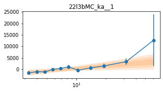
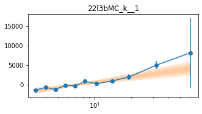

```python
import os
import sys
base_dir = '/home/abzoghbi/data/swift_j2127.4p5654/nustar_re_analysis'
if not base_dir in sys.path: sys.path.insert(0, base_dir)

from helpers import *

%load_ext autoreload
%autoreload 2
```


```python
os.chdir(base_dir)
wdir = 'data/timing'
os.system('mkdir -p %s/lag'%wdir)
os.chdir(wdir)

nu_obsids = np.array(['60001110002', '60001110003', '60001110005', '60001110007', '60402008002', 
                      '60402008004', '60402008006', '60402008008', '60402008010'])
```


```python
#!rm lc_22l3_512.npz
loc_info, nen, dt = [base_dir, '22l3'], 22, 512
LC = read_lc(loc_info, nu_obsids, dt, nen, combine_ab=True)

#!rm lc_22l3_512_bgd.npz
loc_info, nen, dt = [base_dir, '22l3'], 22, 512
LCb = read_lc(loc_info, nu_obsids, dt, nen, combine_ab=True, bgd=True)

LC = remove_high_bgd(LC, LCb)
```

    reading data from lc_22l3_512.npz ..
    reading data from lc_22l3_512_bgd.npz ..


```python
# average counts per bin #
txt = '\n'.join([' '.join(['%8.4g'%(l[1].mean()*dt) for l in lc]) for lc in LC])
print(txt)
```

        33.5    40.17     41.4    48.36    91.71    64.85    58.67     36.4    44.19
       41.37    49.85    54.18    63.63    116.6    79.83    73.23    47.57    56.68
       54.66    66.92     72.2    83.11    156.6    107.1    101.9    62.04    77.98
       57.78    72.51    74.98     87.9    155.1    107.1    102.1    64.67    78.53
       49.26    58.26    64.74    73.18    132.9    94.03    86.33    55.96    68.06
       58.08    71.51    76.28    89.05    156.4    107.1    102.2    66.98    81.55
        61.2    72.68    80.47    89.09    156.8    111.3      105    71.16    84.51
       74.74    86.35    97.36    105.2    182.7    131.2    123.6    84.09    101.3
       69.28    79.38    86.56    97.72    165.5    120.4    112.8    76.94    90.29
       63.14    76.12    81.98    91.67    152.2    112.1    104.7    72.22    84.63
       51.71    60.75     66.5    75.92    121.8     86.5    84.35    57.03    69.46
       53.33    63.99    68.82       75    121.1    86.63    84.22    59.21    70.71
       53.35    60.36    66.65    74.99    115.3    83.44    81.05    58.84    68.36
       69.63    79.44    85.82    95.91    143.6    105.4      104    76.96    87.22
        52.8    65.81    70.08    75.11    111.5    79.41    80.38    61.22    69.92
       44.34    51.31    56.89    61.18    85.74    62.54    62.75       49    58.29
       34.55     42.1    44.58    46.11    63.67    48.62    47.44    38.31    43.68
       25.54    29.19    32.42     32.8    41.72    33.67    35.28    27.73    31.83
       35.22    39.32     42.8    44.01    50.85    42.72    43.74    36.99    40.73
       15.51    15.12    15.75    14.79       17    14.21    15.88    14.58    14.58
       11.93    11.19    10.11     8.89    11.21     9.62    10.91    9.911     8.34
       15.18    9.826     9.52    7.557    9.457    10.23    12.89    10.81    8.771


```python
# plot light curves
ie = 21
nlc = len(LC[ie])
fig, ax = plt.subplots(nlc, 1, figsize=(12, 10))
for ilc,lc in enumerate(LC[ie]):
    ax[ilc].errorbar((lc[0] - lc[0][0])/1e3, lc[1], lc[2], fmt='o', ms=3, alpha=0.5)
    ax[ilc].set_xlim([0, 150])
plt.tight_layout()
```


    

    


```python
ebins, dt = ('3 3.3 3.6 4 4.4 4.8 5.2 5.7 6.3 6.9 7.6 8.3 9.1 10 '
             '11.7 13.8 16.2 19 22 31 42 58 79'), 512
tlen = 70
Lc, LcIdx = split_LC_to_segments(LC, tlen*1e3, plot=False)
```

### `_k`: Reproduce lags in Fig 3 and 4 in Kara+14: `<4e-5 4.5e-4`


```python
fqL = np.array([8e-6, 1e-5, 4e-5, 4.5e-4, 2e-3])
iEn = [[0,1], [2,3], [4,5], [6,7], [8,9], [10,11], [12,13], [14,15], [16,17], [18,19], [20,21]]
lag_k = calculate_lag(Lc, fqL, dt, ebins, 'lag/lag_22l3b_k.npz', iEn=iEn, mcmc=[-4, 2000], logmod=False)
```

    cache file lag/lag_22l3b_k.npz found. Reading ...!


```python
lag_ka = calculate_lag(Lc, fqL, dt, ebins, 'lag/lag_22l3b_ka.npz', iEn=iEn, iLc=[0,1,2,3],  
                       mcmc=[-4, 2000], logmod=False)
```

    cache file lag/lag_22l3b_ka.npz found. Reading ...!


```python
lag_kb = calculate_lag(Lc, fqL, dt, ebins, 'lag/lag_22l3b_kb.npz', iEn=iEn, iLc=[4,5,6,7,8], 
                       mcmc=[-4, 2000], logmod=False)
```

    cache file lag/lag_22l3b_kb.npz found. Reading ...!


```python
# process mcmc from fqlag and plot histograms 
lagMC_k = proc_lag_mcmc('lag_22l3b_k')
lagMC_ka = proc_lag_mcmc('lag_22l3b_ka')
lagMC_kb = proc_lag_mcmc('lag_22l3b_kb')
```


    

    


    

    


    

    


```python
# plot lag-energy data from the mcmc chains #
for x in ['a', 'b', '']:
    exec('plot_lag(lagMC_k%s)'%x)
    exec('write_lag(lagMC_k%s, "_22l3bMC_k%s", pha=True)'%(x,x))
```


    

    


    

    


    

    


```python
# Model the PHA data from fqlag mcmc with xspec
os.chdir('%s/%s/lag/pha'%(base_dir, wdir))
for x in ['a', 'b', '']:
    fit_pha_with_loglin('22l3bMC_k%s__1'%x, recalc=1)
    fit_pha_with_loglin('22l3bMC_k%s__2'%x, recalc=1)
os.chdir('%s/%s'%(base_dir, wdir))
```

    chains for 22l3bMC_ka__1
    chains for 22l3bMC_ka__2
    chains for 22l3bMC_kb__1
    chains for 22l3bMC_kb__2
    chains for 22l3bMC_k__1
    chains for 22l3bMC_k__2


    

    


    

    


    

    


    

    


    

    


    

    


```python
# Model the PHA data from fqlag mcmc with xspec; do the two frequencies simultaneously
os.chdir('%s/%s/lag/pha'%(base_dir, wdir))
for x in ['a', 'b', '']:
    fit_pha_with_loglin('22l3bMC_k%s__1'%x, recalc=1, do_f2=1)
os.chdir('%s/%s'%(base_dir, wdir))
```

    chains for 22l3bMC_ka__12
    chains for 22l3bMC_kb__12
    chains for 22l3bMC_k__12


    

    


    

    


    

    


---

## Different Frequency binning
### Lag vs freq
Compare iron line to Compton hump and highest energies


```python
# '3 3.3 3.6 4 4.4 4.8 5.2 5.7 6.3 6.9 7.6 8.3 9.1 10 11.7 13.8 16.2 19 22 31 42 58 79'
fqL, fqd = get_fq_bins(Lc[0], dt, mode=1, Nfq=5)
iEn = [[6,7,8], [16,17,18], [19,20,21]]
lag_fq_1 = calculate_lag(Lc, fqL, dt, ebins, 'lag/lag_fq_1.npz', iEn=iEn, iref=[0,1,2,3,4,5], 
                        mcmc=[-4, 2000], logmod=False)
```

    nfq:  7
    fqL:  5.71089e-06 1.0782e-05 4.07122e-05 7.68634e-05 0.000145116 0.000273974 0.000517255 0.00195312
    cache file lag/lag_fq_1.npz found. Reading ...!


```python
# process mcmc from fqlag and plot histograms 
lag_fqMC_1 = proc_lag_mcmc('lag_fq_1')
```


    

    


```python
plot_lag(lag_fqMC_1)
write_lag(lag_fqMC_1, '_fqMC_1', pha=False, null_tests=False, pha_fq=True)
```


    

    


---
### `_e1`: Followup the `_fqMC__1` results


```python
# 5.71089e-06 1.0782e-05 4.07122e-05 7.68634e-05 0.000145116 0.000273974 0.000517255 0.00195312
fqL = np.array([5e-6, 1e-5, 8e-5, 1.5e-4, 3e-4, 2e-3])
iEn = [[0,1], [2,3], [4,5], [6,7], [8,9], [10,11], [12,13], [14,15], [16,17], [18,19], [20,21]]
lag_e1 = calculate_lag(Lc, fqL, dt, ebins, 'lag/lag_22l3b_e1.npz', iEn=iEn, mcmc=[-4, 2000], logmod=False)
```

    cache file lag/lag_22l3b_e1.npz found. Reading ...!


```python
# process mcmc from fqlag and plot histograms 
lagMC_e1 = proc_lag_mcmc('lag_22l3b_e1')
```


    

    


```python
plot_lag(lagMC_e1)
write_lag(lagMC_e1, '_22l3bMC_e1', pha=True)
```


    

    


```python
# Model the PHA data from fqlag mcmc with xspec
os.chdir('%s/%s/lag/pha'%(base_dir, wdir))
fit_pha_with_loglin('22l3bMC_e1__1', recalc=1)
fit_pha_with_loglin('22l3bMC_e1__2', recalc=1)
fit_pha_with_loglin('22l3bMC_e1__3', recalc=1)
os.chdir('%s/%s'%(base_dir, wdir))
```

    chains for 22l3bMC_e1__1
    chains for 22l3bMC_e1__2
    chains for 22l3bMC_e1__3


    

    


    

    


    

    


###  `_e1` for individual groups


```python
lag_e1a = calculate_lag(Lc, fqL, dt, ebins, 'lag/lag_22l3b_e1a.npz', iEn=iEn, iLc=[0,1,2,3],  
                       mcmc=[-4, 2000], logmod=False)
```

    cache file lag/lag_22l3b_e1a.npz found. Reading ...!


```python
lag_e1b = calculate_lag(Lc, fqL, dt, ebins, 'lag/lag_22l3b_e1b.npz', iEn=iEn, iLc=[4,5,6,7,8], 
                       mcmc=[-4, 2000], logmod=False)
```

    cache file lag/lag_22l3b_e1b.npz found. Reading ...!


```python
# process mcmc from fqlag and plot histograms 
lagMC_e1 = proc_lag_mcmc('lag_22l3b_e1')
lagMC_e1a = proc_lag_mcmc('lag_22l3b_e1a')
lagMC_e1b = proc_lag_mcmc('lag_22l3b_e1b')
```


    

    


    

    


    

    


```python
# plot lag-energy data from the mcmc chains #
for x in ['a', 'b', '']:
    exec('plot_lag(lagMC_e1%s)'%x)
    exec('write_lag(lagMC_e1%s, "_22l3bMC_e1%s", pha=True)'%(x,x))
```


    

    


    

    


    

    


```python
plot_lag(lagMC_e1)
```


    

    


---
### `_e1C`: Similar `_e1` but fit for the full cross spectrum instead of a transfer function


```python
fqL = np.array([5e-6, 1e-5, 8e-5, 1.5e-4, 3e-4, 2e-3])
iEn = [[0,1], [2,3], [4,5], [6,7], [8,9], [10,11], [12,13], [14,15], [16,17], [18,19], [20,21]]
lag_e1C = calculate_lag_cross(Lc, fqL, dt, ebins, 'lag/lag_22l3b_e1C.npz', iEn=iEn, mcmc=[-4, 4000], logmod=False)
```

    cache file lag/lag_22l3b_e1C.npz found. Reading ...!


```python
# process mcmc from fqlag and plot histograms 
lagMC_e1C = proc_lag_mcmc('lag_22l3b_e1C')
```


    

    


```python
# write cross spectrum to pha files to model it

# (nen, 11, nfq); 11: fq, p,pe, amp,ampe, phi,phie(std), lag,lage, dphi-,dphi+
Res_mc, En, fqd, extra = lagMC_e1C
cxd,cxde = Res_mc[:,3], Res_mc[:,4]
os.chdir('lag/pha')
for i in [1,2,3]:
    az.misc.write_pha_spec(En[0]-En[1], En[0]+En[1], cxd[:,i], cxde[:,i], f'cxd_22l3bMC_e1C__{i}')

os.chdir('../..')
```

    cxd_22l3bMC_e1C__1.pha was created successfully
    cxd_22l3bMC_e1C__2.pha was created successfully
    cxd_22l3bMC_e1C__3.pha was created successfully


```python
plt.errorbar(En[0], cxd[:,1], cxde[:,1])
plt.errorbar(En[0], cxd[:,2], cxde[:,2])
plt.errorbar(En[0], cxd[:,3], cxde[:,3])
plt.xscale('log')
#plt.yscale('log')
```


    

    


```python
np.std?
```


```python
# calculate the rms vs energy to estimate the variable spectrum #
s2 = np.array([[l[1].var(ddof=1) for l in lc] for lc in Lc])
e2 = np.array([[(l[2]**2).mean() for l in lc] for lc in Lc])
m2 = np.array([[l[1].mean()**2 for l in lc] for lc in Lc])
N  = np.array([[len(l[1]) for l in lc] for lc in Lc])
fvar  = (np.clip(s2 - e2, 0, np.inf)/m2)**0.5
fvarE = ((e2/N)/m2)**0.5
Fvar  = fvar.mean(1)
FvarE = (np.sum(fvarE**2, 1)**0.5)/fvar.shape[1]
En = np.array(ebins.split(), np.double)
en  = (En[1:] + En[:-1])/2
ene = (En[1:] - En[:-1])/2
```


```python
for i in range(5):
    plt.errorbar(en, fvar[:,i], fvarE[:,i], fmt='o-')
plt.xscale('log')
```


    

    


```python

```
