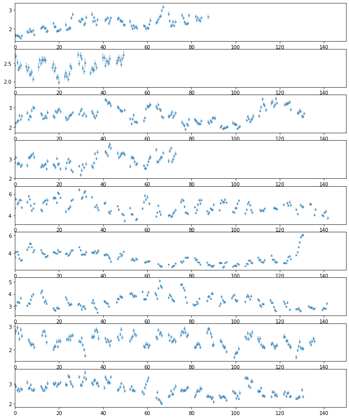
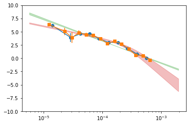

```python
import os
import sys
base_dir = '/home/abzoghbi/data/swift_j2127.4p5654/nustar_re_analysis'
if not base_dir in sys.path: sys.path.insert(0, base_dir)

from helpers import *

%load_ext autoreload
%autoreload 2
```

    The autoreload extension is already loaded. To reload it, use:
      %reload_ext autoreload


```python
os.chdir(base_dir)
wdir = 'data/timing'
os.system('mkdir -p %s'%wdir)
os.chdir(wdir)

nu_obsids = np.array(['60001110002', '60001110003', '60001110005', '60001110007', '60402008002', 
                      '60402008004', '60402008006', '60402008008', '60402008010'])
```

## 3-79 keV Total light curve


```python
#!rm lc_1b_512.npz
loc_info, nen, dt = [base_dir, '1b'], 1, 512
LC = read_lc(loc_info, nu_obsids, dt, nen, combine_ab=True)

#!rm lc_22l3_512_bgd.npz
loc_info, nen, dt = [base_dir, '22l3'], 22, 512
LCb = read_lc(loc_info, nu_obsids, dt, nen, combine_ab=True, bgd=True)

LC = remove_high_bgd(LC, LCb)
```

    reading data from lc_1b_512.npz ..
    reading data from lc_22l3_512_bgd.npz ..


```python
# plot light curves
nlc = len(LC[0])
fig, ax = plt.subplots(nlc, 1, figsize=(12, 15))
for ilc,lc in enumerate(LC[0]):
    ax[ilc].errorbar((lc[0] - lc[0][0])/1e3, lc[1], lc[2], fmt='o', ms=3, alpha=0.5)
    ax[ilc].set_xlim([0, 150])
    
```


    

    


```python
dates = []
for o in nu_obsids:
    with pyfits.open(f'{base_dir}/data/nustar/{o}_p/lc/1b/lc_512__a__1.lc') as fp:
        dates.append(fp[1].header['date-obs'])
dates = TT.Time(dates)
```


```python
# write lc
os.system('mkdir -p psd')
txt = ''
t0 = 0
for ilc,lc in enumerate(LC[0]):
    tt = lc[0] - lc[0][0] + t0
    t0 = tt[-1] + 1e4
    tmjd = (dates[ilc] + TT.TimeDelta(lc[0] - lc[0][0], format='sec')).mjd
    txt += '\ndescriptor t_%d rate_%d,+- tt_%d tmjd_%d\n'%(ilc+1,ilc+1,ilc+1, ilc+1)
    txt += '\n'.join(['%10.10g %10.3g %10.3g %10.10g %10.7g'%(t,r,re,t_,_tm) for t,r,re,t_,_tm in 
                      zip(lc[0]-lc[0][0], lc[1], lc[2], tt, tmjd)])
with open('psd/lc_%g.plot'%(dt), 'w') as fp: fp.write(txt)
```

---
## PSD


```python
# get segments #
tlen = 70
Lc, LcIdx = split_LC_to_segments(LC, tlen*1e3, plot=False)
```


```python
# frequency bins
fqL, fqd = get_fq_bins(Lc[0], dt, mode=1, Nfq=10, nyquist=0.5)
psd_all_f1 = calculate_psd(Lc[0], fqL, 'psd/psd_all_f1.npz', errors=True)
```

    nfq:  12
    fqL:  5.71089e-06 8.27373e-06 2.39733e-05 3.47317e-05 5.03179e-05 7.28987e-05 0.000105613 0.000153008 0.000221672 0.00032115 0.000465271 0.000674067 0.00195312
       126.083 |       4.92       6.15        3.9        4.6       4.65       3.68       2.98          3       1.86       0.79      0.069      -3.85 |   5.84e-07
    ** done **
    
       126.083 |       4.92       6.15        3.9        4.6       4.65       3.68       2.98          3       1.86       0.79      0.069      -3.85 |    2.6e-07
    ** done **
    
    	## errors for param 0 ##
        126.083    125.582    4.92058    6.58456    1.00218
    	## errors for param 1 ##
        126.083    125.581    6.15142    6.43212    1.00478
    	## errors for param 2 ##
        126.083    125.579    3.90129    4.69842    1.00795
    	## errors for param 3 ##
        126.083    125.585     4.5973    4.95267   0.994948
    	## errors for param 4 ##
        126.083    125.583    4.64735    4.90512   0.998878
    	## errors for param 5 ##
        126.083    125.584    3.68308    3.93645   0.997221
    	## errors for param 6 ##
        126.083    125.588    2.98128    3.23562    0.99037
    	## errors for param 7 ##
        126.083    125.585    3.00326    3.18251   0.996679
    	## errors for param 8 ##
        126.083    125.584     1.8554      2.083   0.998198
    	## errors for param 9 ##
        126.083    125.578   0.790132    1.08586    1.00964
    	## errors for param 10 ##
        126.083    125.583  0.0689913   0.337982   0.999747
    	## errors for param 11 ##
        126.083    125.587   -3.84914   -2.51337   0.991134
    ********************
          4.92       6.15        3.9        4.6       4.65       3.68       2.98          3       1.86       0.79      0.069      -3.85
          1.66      0.281      0.797      0.355      0.258      0.253      0.254      0.179      0.228      0.296      0.269       1.34
    ********************


```python
# Another frequency binning
fqL, fqd = get_fq_bins(Lc[0], dt, mode=1, Nfq=14, nyquist=0.5)
psd_all_f2 = calculate_psd(Lc[0], fqL, 'psd/psd_all_f2.npz', errors=True)
```

    nfq:  16
    fqL:  5.71089e-06 7.5414e-06 1.99173e-05 2.63013e-05 3.47317e-05 4.58641e-05 6.05649e-05 7.99777e-05 0.000105613 0.000139465 0.000184167 0.000243198 0.00032115 0.000424088 0.000560021 0.000739524 0.00195312
       128.026 |        -30       6.34       5.07       3.89       4.84       4.45       4.34       3.67       2.78       3.22       2.69       1.82      0.568      0.512     -0.388        -18 |   7.99e-17
    ** done **
    
       128.026 |        -30       6.34       5.07       3.89       4.84       4.45       4.34       3.67       2.78       3.22       2.69       1.82      0.568      0.512     -0.388        -18 |   7.99e-17
    ** done **
    
    	## errors for param 0 ##
    	## errors for param 1 ##
        128.026    127.526    6.33941    6.60503    1.00028
    	## errors for param 2 ##
        128.026    127.526       5.07    5.76921    1.00044
    	## errors for param 3 ##
        128.026    127.523    3.88629    4.87066    1.00664
    	## errors for param 4 ##
        128.026    127.528    4.83719    5.22782   0.997309
    	## errors for param 5 ##
        128.026    127.527    4.45166    4.81104   0.998306
    	## errors for param 6 ##
        128.026    127.524    4.34309    4.64777    1.00486
    	## errors for param 7 ##
        128.026    127.523    3.67401    3.95136    1.00647
    	## errors for param 8 ##
        128.026     127.53    2.78425    3.10457   0.992306
    	## errors for param 9 ##
        128.026    127.525    3.21512    3.43387    1.00314
    	## errors for param 10 ##
        128.026    127.524    2.69011    2.89714    1.00421
    	## errors for param 11 ##
        128.026     127.53    1.81543    2.05371   0.991899
    	## errors for param 12 ##
        128.026    127.521   0.567792   0.970136    1.00973
    	## errors for param 13 ##
        128.026    127.527    0.51227   0.783755   0.998757
    	## errors for param 14 ##
        128.026    127.525  -0.387784 -0.0284093    1.00141
    	## errors for param 15 ##
    ********************
         -33.9       6.34       5.07       3.89       4.84       4.45       4.34       3.67       2.78       3.22       2.69       1.82      0.568      0.512     -0.388        -18
           9.5      0.266      0.699      0.984      0.391      0.359      0.305      0.277       0.32      0.219      0.207      0.238      0.402      0.271      0.359        9.5
    ********************


```python
# Analytical fit with PL and BPL
psd_all_f = calculate_psd(Lc[0], fqL, 'psd/psd_all_f.npz', do_bin=0, do_pl=1, do_bpl=1, errors=True)
```

       80.5587 |      -13.3       -1.8 |    7.1e-07
    ** done **
    
       80.5587 |      -13.3       -1.8 |   2.82e-11
    ** done **
    
    	## errors for param 0 ##
        80.5587    80.0558   -13.3166   -12.8427    1.00591
    	## errors for param 1 ##
        80.5587    80.0634   -1.79922   -1.74445   0.990602
    ********************
         -13.3       -1.8
         0.474     0.0548
    ********************
       120.181 |      -5.47      -3.86      -8.28 |   1.79e-05
    ** done **
    
       120.181 |      -5.47      -3.86      -8.28 |    1.4e-05
    ** done **
    
    	## errors for param 0 ##
        120.181    119.685   -5.46904   -5.35771   0.990184
    	## errors for param 1 ##
        120.181    119.677   -3.86465   -3.46622    1.00745
    	## errors for param 2 ##
        120.181    119.681   -8.27844   -8.15637   0.999052
    ********************
         -5.47      -3.86      -8.28
         0.111      0.398      0.122
    ********************


```python
# plot the psd #

pBin = psd_all_f1['p_Bin']
plt.errorbar(pBin[0][1:-1], pBin[1][1:-1], pBin[2][1:-1], fmt='o-')

pBin = psd_all_f2['p_Bin']
plt.errorbar(pBin[0][1:-1], pBin[1][1:-1], pBin[2][1:-1], fmt='s-')

mPL = psd_all_f['m_pl']
plt.fill_between(mPL[0], mPL[1]-mPL[2], mPL[1]+mPL[2], alpha=0.3, color='C2')

mBPL = psd_all_f['m_bpl']
plt.fill_between(mBPL[0], mBPL[1]-mBPL[2], mBPL[1]+mBPL[2], alpha=0.3, color='C3')
plt.xscale('log')
plt.ylim([-10, 10])
```


    (-10, 10)


    

    


```python
# write psd_all #
txt = 'descriptor fq_f1 psd_f1,+-\n'
txt += '\n'.join(['%g %g %g'%(z[0], z[1], z[2]) for z in psd_all_f1['p_Bin'][:,1:-1].T])
txt += '\ndescriptor fq_f2 psd_f2,+-\n'
txt += '\n'.join(['%g %g %g'%(z[0], z[1], z[2]) for z in psd_all_f1['p_Bin'][:,1:-1].T])
txt += '\ndescriptor fq_pl psd_pl,+-\n'
txt += '\n'.join(['%g %g %g'%(z[0], z[1], z[2]) for z in psd_all_f['m_pl'].T])
txt += '\ndescriptor fq_bpl psd_bpl,+-\n'
txt += '\n'.join(['%g %g %g'%(z[0], z[1], z[2]) for z in psd_all_f['m_bpl'].T])
with open('psd/psd_all.plot', 'w') as fp: fp.write(txt)
    
p,pe = psd_all_f1['p_Bin'][1:,1:-1]
fqL = psd_all_f1['fqL'][1:-1]
az.misc.write_pha_spec(fqL[:-1], fqL[1:], p, pe, 'psd_f1')
p,pe = psd_all_f2['p_Bin'][1:,1:-1]
fqL = psd_all_f2['fqL'][1:-1]
az.misc.write_pha_spec(fqL[:-1], fqL[1:], p, pe, 'psd_f2')
os.system('mkdir -p psd/pha')
os.system('mv *pha *rsp *xsp psd/pha')
```

    psd_f1.pha was created successfully
    psd_f2.pha was created successfully


    0


```python

```
